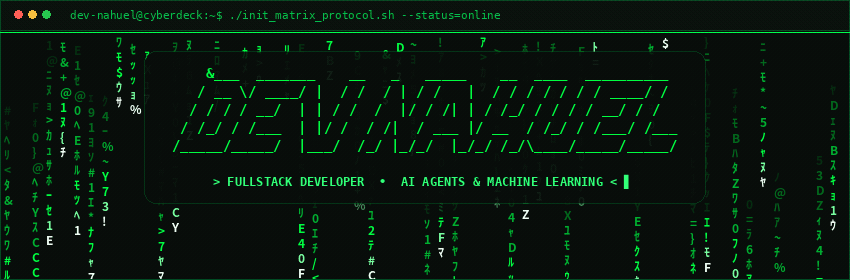

  

# 😁 ¡Hola! Soy Nahuel

## Bienvenido a mi GitHub

Soy un desarrollador web argentino apasionado por aprender nuevas tecnologías y aplicarlas en mi día a día para crear productos de software innovadores, robustos y realmente útiles. Me desempeño tanto en el frontend como en el backend, lo que me permite comprender la ingeniería web de forma integral: desde experiencias de usuario intuitivas hasta arquitecturas y lógica de servidor escalables.

Disfruto trabajar con tecnologías modernas, optimizar flujos y diseñar sistemas eficientes. Cuento con un gran interés y enfoque activo en el desarrollo de agentes de IA, así como en la Inteligencia Artificial en general y el Machine Learning, investigando e implementando cómo estas herramientas inteligentes y autónomas pueden transformar aplicaciones, resolver problemas complejos y automatizar procesos clave.

Asimismo, integro buenas prácticas de desarrollo y conceptos esenciales de ciberseguridad para construir plataformas seguras, resilientes y confiables, siempre motivado por enfrentar nuevos desafíos técnicos y llevar cada proyecto al siguiente nivel.

> **En constante evolución y creciendo con [Nexus Studio]([nexus-studio-dev.netlify.app](https://nexus-studio-dev.netlify.app/))**

## 🎨 Tecnologías que domino

🧠 Lenguajes base

    

🖌️ Frontend

   

🛠️ Backend

   

🗄️ Bases de datos

   

🤖 IA y Machine Learning

  

🔧 Otras herramientas

   
